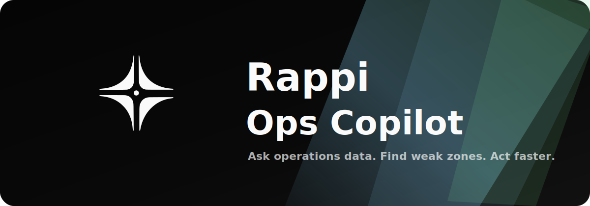

<p align="center">
  
</p>

# Rappi Ops Copilot

Conversational analytics prototype for Rappi operations KPIs.

The user asks questions such as "Which zones have the lowest Perfect Orders?"
or "Compare wealthy vs non-wealthy zones in Mexico". The system turns those
questions into guarded analytical queries, returns an explanation, and can
export CSV/PDF results.

## How It Works

1. The Excel workbook in `data/` is normalized into analytics tables.
2. Postgres stores the cleaned operational metrics.
3. FastAPI exposes schema context, read-only SQL execution, reports, and exports.
4. n8n orchestrates the chat flow and calls DeepSeek `deepseek-v4-pro`.
5. The model plans the analysis and writes SQL, but the API enforces guardrails:
   only `SELECT`/`WITH`, no write/admin statements, no comments, read-only DB
   access, and server-side row limits.
6. The Next.js app provides the local chat UI and latest executive report view.

## Repository Structure

```text
.
|-- data/              # Source workbook
|-- db/                # Postgres schema
|-- docs/              # Design notes and visual prompts
|-- frontend/          # Next.js UI
|-- ops_copilot/       # FastAPI app, ingestion, query, reports
|-- scripts/           # Setup, ingestion, smoke tests
|-- workflows/         # n8n workflow exports
|-- docker-compose.yml # Local reproducible stack
`-- README.md
```

## Technical Decisions

- **FastAPI**: simple Python API for analytics endpoints, report generation, and
  deterministic validation around model-generated SQL.
- **Postgres**: reliable relational layer for metric queries, joins, filters,
  and aggregation.
- **n8n**: makes the LLM workflow importable and inspectable without hiding the
  orchestration in application code.
- **Next.js**: quick local UI for chat, report preview, and exports.
- **DeepSeek `deepseek-v4-pro`**: strong cost/performance option for tool use,
  SQL planning, bilingual answers, and structured report authoring.
- **Docker Compose**: one command starts Postgres, API, n8n, and the web app.

## Estimated Paid API Cost

Only the DeepSeek calls are paid. Deterministic API calls, ingestion, smoke
tests, CSV exports, and deterministic PDF rendering do not call paid APIs.

Using DeepSeek's published `deepseek-v4-pro` prices:

- Input cache miss: `$0.435` per 1M tokens
- Input cache hit: `$0.003625` per 1M tokens
- Output: `$0.87` per 1M tokens

Estimated usage:

- 10-question chat session: about `$0.10`
- Executive insight narrative generation: about `$0.01` to `$0.02` per report
- Optional LLM LaTeX repair, only if triggered: about `$0.01` to `$0.02`

Pricing source: https://api-docs.deepseek.com/quick_start/pricing

## Run Locally

Requirements:

- Docker and Docker Compose
- Python 3.11+
- DeepSeek API key for live chat and LLM-authored reports

Create the environment file:

```bash
cp .env.example .env
```

Fill these values in `.env`:

```bash
POSTGRES_PASSWORD=
DEEPSEEK_API_KEY=
DEEPSEEK_MODEL=deepseek-v4-pro
N8N_ENCRYPTION_KEY=
```

Generate local secrets if needed:

```bash
openssl rand -base64 32
```

Install Python dependencies:

```bash
python3 -m venv .venv
source .venv/bin/activate
python -m pip install -e ".[dev]"
```

Start the stack:

```bash
docker compose up --build
```

Import and activate the n8n workflows:

```bash
python3 scripts/setup_n8n.py --activate
```

Open:

```text
Web app: http://localhost:3000
n8n:     http://localhost:5678
API:     http://localhost:8000/health
```

## Validate

Run the contract tests and deterministic smoke test:

```bash
python -m pytest
python3 scripts/smoke_test.py
```

Optional frontend checks:

```bash
cd frontend
npm install
npm run typecheck
npm run build
```

## Reproducibility

The project is reproducible because it includes:

- Source workbook in `data/`
- Database schema in `db/schema.sql`
- Docker services in `docker-compose.yml`
- Python dependencies in `pyproject.toml`
- Frontend lockfile in `frontend/package-lock.json`
- n8n workflow exports in `workflows/`
- Environment template in `.env.example`
- Pytest contract tests in `tests/`
- Setup automation in `scripts/setup_n8n.py`
- Smoke test in `scripts/smoke_test.py`

If the DeepSeek account has no available balance, the deterministic API and
smoke tests still work. The live chat workflow will fail until billing is
enabled.

## Troubleshooting

- If n8n setup fails, confirm `docker compose up --build` is running and
  `.env` contains `DEEPSEEK_API_KEY`.
- If the chat webhook fails, open n8n at `http://localhost:5678` and inspect the
  latest execution.
- If exports return `404`, rerun the query first. Export IDs are cached in
  memory for the current API process.
