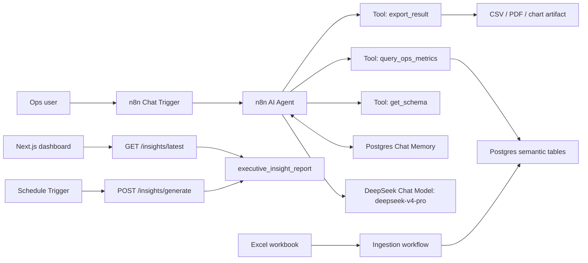

# n8n Rappi Ops Copilot Design

## Goal

Build a conversational analytics bot for non-technical operations users. Users ask questions in Spanish, English, or mixed language about operational metrics, and the bot returns accurate answers, charts when useful, proactive follow-ups, and optional CSV/PDF exports.

The examples in the prompt are not templates. The bot should support arbitrary natural language by letting DeepSeek interpret the request, choose the analytical logic, generate read-only SQL, inspect the returned data, and explain the result.

## Current Data Source

Workbook:

`data/Sistema de Análisis Inteligente para Operaciones Rappi - Dummy Data (2) (1) (3) (1) (1) (1) (1) (1) (2).xlsx`

Sheets inspected:

| Sheet | Shape | Purpose |
| --- | ---: | --- |
| `RAW_INPUT_METRICS` | 12,573 x 15 | Main operational metrics by country, city, zone, segment, metric, and weekly offset |
| `RAW_ORDERS` | 1,242 x 13 | Orders by country, city, zone, and weekly offset |
| `RAW_SUMMARY` | 15 x 4 | Inferred column descriptions |

`RAW_INPUT_METRICS` columns:

| Column | Meaning |
| --- | --- |
| `COUNTRY` | Country code: AR, BR, CL, CO, CR, EC, MX, PE, UY |
| `CITY` | City |
| `ZONE` | Operational zone |
| `ZONE_TYPE` | `Wealthy` or `Non Wealthy` |
| `ZONE_PRIORITIZATION` | `High Priority`, `Prioritized`, `Not Prioritized` |
| `METRIC` | Metric name |
| `L8W_ROLL` ... `L0W_ROLL` | Rolling weekly metric values, where `L0W_ROLL` is the most recent week |

`RAW_ORDERS` columns:

| Column | Meaning |
| --- | --- |
| `COUNTRY`, `CITY`, `ZONE` | Same dimensions as metrics |
| `METRIC` | Currently `Orders` |
| `L8W` ... `L0W` | Weekly order counts, where `L0W` is the most recent week |

Metric catalog in `RAW_INPUT_METRICS`:

| Metric | Default direction |
| --- | --- |
| `Gross Profit UE` | Higher is better |
| `Perfect Orders` | Higher is better |
| `Lead Penetration` | Higher is usually better, but validate outliers |
| `% PRO Users Who Breakeven` | Higher is better |
| `% Restaurants Sessions With Optimal Assortment` | Higher is better |
| `MLTV Top Verticals Adoption` | Higher is better |
| `Non-Pro PTC > OP` | Needs business-owner confirmation |
| `Pro Adoption (Last Week Status)` | Higher is better |
| `Restaurants Markdowns / GMV` | Needs business-owner confirmation, likely lower cost is better |
| `Restaurants SS > ATC CVR` | Higher is better |
| `Restaurants SST > SS CVR` | Higher is better |
| `Retail SST > SS CVR` | Higher is better |
| `Turbo Adoption` | Higher is better |
| `Orders` | Higher is better for growth questions |

Data caveats:

- The summary tab uses `L8W_VALUE` style names, but the actual metrics sheet uses `L8W_ROLL` style names.
- `Lead Penetration` has extreme outliers, including values far above normal rate-like ranges. Rankings and averages must include outlier handling or at least a caveat.
- The workbook has relative weekly offsets, not absolute calendar dates. The bot should say "most recent available week" instead of pretending to know a calendar date.
- For "last 8 weeks", default to `L7W` through `L0W` because that is 8 data points. Use `L8W` through `L0W` only when the user says "last 9 weeks" or explicitly includes 8 weeks ago.
- Rate metrics have no numerator/denominator in the workbook. Country/city averages should be simple averages unless a confirmed weighting rule is added.

## Recommended Architecture

Use n8n as the orchestration and chat surface, DeepSeek `deepseek-v4-pro` as the reasoning/model layer, and Postgres as the analytical store.

Postgres is recommended even for the demo because it gives the model a clear SQL surface, repeatable exports, persistent chat memory, and avoids loading the Excel file on every chat turn.



Why this shape:

- n8n has a Chat Trigger with prior-session loading and streaming response support.
- n8n AI Agent can call tools/sub-workflows, which lets the model ask for data without seeing the full dataset.
- n8n has a DeepSeek Chat Model node; DeepSeek documents `deepseek-v4-pro` as a current model with JSON output and tool-call support.
- The analysis path is model-led: DeepSeek plans and writes SQL; the API enforces read-only execution, row limits, and exports.

Reference docs:

- n8n Chat Trigger: https://docs.n8n.io/integrations/builtin/core-nodes/n8n-nodes-langchain.chattrigger/
- n8n AI Agent and tools: https://docs.n8n.io/integrations/builtin/cluster-nodes/root-nodes/n8n-nodes-langchain.agent/
- n8n DeepSeek Chat Model: https://docs.n8n.io/integrations/builtin/cluster-nodes/sub-nodes/n8n-nodes-langchain.lmchatdeepseek/
- n8n Call n8n Workflow Tool pattern: https://docs.n8n.io/advanced-ai/examples/data-google-sheets/
- DeepSeek models/pricing: https://api-docs.deepseek.com/quick_start/pricing
- DeepSeek chat completion API: https://api-docs.deepseek.com/api/create-chat-completion

## Workflows

### 1. `rappi_ops_ingest_workbook`

Purpose: Normalize the Excel workbook into queryable database tables.

Trigger options:

- Manual Trigger for demo.
- Schedule Trigger for production refresh.
- Google Drive Trigger if the workbook will be maintained in Drive.

Node design:

1. Read workbook
   - Self-hosted n8n: `Read/Write Files from Disk`.
   - n8n Cloud: store workbook in Google Drive or object storage and use that node.
2. Extract from file
   - Read sheets `RAW_INPUT_METRICS` and `RAW_ORDERS`.
3. Code node: normalize metrics from wide to long.
4. Code node: normalize orders from wide to long.
5. Postgres: upsert dimensions and facts.
6. Code node: data-quality report.
7. Optional: send refresh summary to Slack/email.

Target tables:

```sql
create table dim_zone (
  zone_id text primary key,
  country text not null,
  city text not null,
  zone text not null,
  zone_type text,
  zone_prioritization text
);

create table semantic_metric (
  metric_key text primary key,
  metric_name text not null unique,
  source text not null,
  default_direction text not null check (default_direction in ('higher_better', 'lower_better', 'unknown')),
  value_kind text not null check (value_kind in ('rate', 'currency_per_order', 'count', 'index', 'unknown')),
  outlier_policy text not null default 'none',
  description text
);

create table fact_metric_week (
  zone_id text not null references dim_zone(zone_id),
  metric_key text not null references semantic_metric(metric_key),
  week_offset int not null check (week_offset between 0 and 8),
  week_label text not null,
  value numeric not null,
  source_column text not null,
  primary key (zone_id, metric_key, week_offset)
);

create table fact_orders_week (
  zone_id text not null references dim_zone(zone_id),
  week_offset int not null check (week_offset between 0 and 8),
  week_label text not null,
  orders numeric not null,
  source_column text not null,
  primary key (zone_id, week_offset)
);

create table query_audit (
  query_id uuid primary key,
  session_id text,
  user_question text not null,
  semantic_request jsonb not null,
  sql_text text,
  row_count int,
  created_at timestamptz default now()
);
```

### 2. `rappi_ops_chat_agent`

Purpose: User-facing chat workflow.

Node design:

1. Chat Trigger
   - Load Previous Session: from memory.
   - Response mode: response nodes or streaming when available.
   - Allowed origin: restrict in production.
2. AI Agent
   - Model: DeepSeek Chat Model.
   - System message: use the prompt in this document.
   - Tools: `get_schema`, `query_ops_metrics`, `export_result`.
3. DeepSeek Chat Model
   - Model: `deepseek-v4-pro`.
   - Base URL: default DeepSeek API or `https://api.deepseek.com`.
   - Temperature: `0.1` to `0.2`.
   - Response format: JSON for planner/validator steps; text for final answer.
   - Timeout: higher than default for complex queries.
4. Postgres Chat Memory
   - Keyed by `sessionId`.
   - Store user preferences, previous filters, previous query IDs, and last result summaries.

### 2b. `rappi_ops_automatic_insights`

Purpose: Generate the executive insight report without a user prompt.

Trigger options:

- Manual Trigger for demos and local validation.
- Schedule Trigger for production. The committed workflow runs every Monday at 07:00 in `America/Bogota`.

Node design:

1. Manual Trigger and Schedule Trigger.
2. HTTP Request to `POST http://ops-api:8000/insights/generate`.
3. Ops API runs deterministic rules for:
   - Anomalies: L0W vs L1W movements greater than 10%.
   - Worrying trends: 3+ consecutive weeks of directional deterioration.
   - Benchmarking: same-country and same-zone-type peer divergence.
   - Correlations: metric relationships such as Lead Penetration and conversion/quality proxies.
   - General opportunities: composite zone risk from weak metrics, deterioration, trends, and prioritization.
4. Ops API persists the latest report in `executive_insight_report` and writes Markdown/JSON copies under `outputs/reports/`.
5. Next.js reads `GET /insights/latest` and links to `GET /insights/latest.md`.

### 3. `rappi_ops_get_schema`

Purpose: Give the agent a compact, current semantic catalog.

Input:

```json
{
  "include_examples": true,
  "language": "es"
}
```

Output:

```json
{
  "dimensions": ["country", "city", "zone", "zone_type", "zone_prioritization", "week_offset"],
  "countries": ["AR", "BR", "CL", "CO", "CR", "EC", "MX", "PE", "UY"],
  "zone_types": ["Wealthy", "Non Wealthy"],
  "metrics": [
    {
      "metric_key": "lead_penetration",
      "metric_name": "Lead Penetration",
      "default_direction": "higher_better",
      "value_kind": "rate",
      "caveat": "contains outliers"
    }
  ],
  "time_semantics": {
    "L0W": "most recent available week",
    "L1W": "one week before L0W",
    "last_8_weeks_default": "L7W through L0W"
  }
}
```

### 4. `rappi_ops_query_metrics`

Purpose: Execute validated analytical requests. This is the core tool.

Input contract:

```json
{
  "question": "Compara el Perfect Order entre zonas Wealthy y Non Wealthy en Mexico",
  "language": "es",
  "intent": "compare",
  "metrics": ["Perfect Orders"],
  "dimensions": ["zone_type"],
  "filters": {
    "country": ["MX"]
  },
  "period": {
    "type": "relative_weeks",
    "start_offset": 0,
    "end_offset": 0
  },
  "aggregation": "avg",
  "sort": [],
  "limit": 50,
  "visualization": "bar",
  "outlier_policy": "flag"
}
```

Supported intents:

| Intent | Examples |
| --- | --- |
| `lookup` | Current value for a metric in a zone |
| `rank` | Top/bottom zones by metric |
| `aggregate` | Average by country/city/segment |
| `compare` | Wealthy vs Non Wealthy, country vs country, zone vs zone |
| `trend` | Evolution over weeks |
| `segment` | High X and low Y zones |
| `diagnose` | Deteriorated/problematic zones |
| `growth` | Fastest-growing orders over N weeks |
| `correlate` | Relationship between two metrics |
| `export` | Return a file based on the previous or current result |

Validation rules:

- Reject metrics not in `semantic_metric`.
- Resolve synonyms before execution. Example: "Perfect Order" maps to `Perfect Orders`.
- Resolve country names to codes. Example: "Mexico" maps to `MX`.
- If a zone/city name is ambiguous, ask a short clarification unless filters make it clear.
- Never let the LLM send raw SQL directly to Postgres.
- Enforce row limits and timeouts.
- For rate-like outliers, either flag, winsorize, or ask the user, depending on the question.

Output contract:

```json
{
  "query_id": "uuid",
  "answer_type": "comparison",
  "period_label": "most recent available week",
  "filters_applied": {
    "country": ["MX"]
  },
  "rows": [
    {
      "zone_type": "Wealthy",
      "metric": "Perfect Orders",
      "week_label": "L0W",
      "value": 0.91,
      "n_zones": 120
    }
  ],
  "chart": {
    "recommended": true,
    "type": "bar",
    "x": "zone_type",
    "y": "value"
  },
  "caveats": [
    "Average is unweighted because denominators are not available."
  ],
  "suggested_followups": [
    "Ver las zonas con Perfect Orders mas bajo dentro de MX",
    "Comparar la tendencia de las ultimas 8 semanas"
  ]
}
```

### 5. `rappi_ops_export_result`

Purpose: Export current or previous result.

Input:

```json
{
  "query_id": "uuid",
  "format": "csv",
  "include_chart": true,
  "language": "es"
}
```

Implementation:

- CSV/XLSX: use n8n `Convert to File`.
- Chart images: use QuickChart, a self-hosted chart renderer, or an internal service that accepts a Chart.js spec.
- PDF: create an HTML report and send it to Gotenberg, APITemplate.io, CloudConvert, or another approved PDF renderer. n8n's built-in `Convert to File` supports CSV/HTML/XLSX but not native PDF generation.
- Return a binary file link or chat attachment, depending on the chosen n8n UI/channel.

## Semantic Layer

The semantic layer is what makes the bot business-aware.

### Synonyms

```yaml
metrics:
  lead_penetration:
    canonical: "Lead Penetration"
    synonyms:
      - "lead penetration"
      - "% lead penetration"
      - "penetracion de leads"
  perfect_orders:
    canonical: "Perfect Orders"
    synonyms:
      - "perfect order"
      - "perfect orders"
      - "orden perfecta"
      - "ordenes perfectas"
  gross_profit_ue:
    canonical: "Gross Profit UE"
    synonyms:
      - "gross profit ue"
      - "gp ue"
      - "profit ue"
  orders:
    canonical: "Orders"
    synonyms:
      - "orders"
      - "ordenes"
      - "pedidos"
```

### Business Phrases

```yaml
business_phrases:
  "zonas problematicas":
    intent: "diagnose"
    definition: "zones with low current performance, deterioration versus prior weeks, or high-priority operational status"
    default_metrics:
      - "Perfect Orders"
      - "Gross Profit UE"
      - "Lead Penetration"
      - "Orders"
    scoring:
      - "direction-adjusted current percentile"
      - "direction-adjusted change from L4W to L0W"
      - "negative slope over L7W to L0W"
      - "zone_prioritization boost for High Priority"
  "alto lead penetration pero bajo perfect order":
    intent: "segment"
    conditions:
      - "Lead Penetration >= p75 within selected comparison universe"
      - "Perfect Orders <= p25 within selected comparison universe"
  "crecen en ordenes":
    intent: "growth"
    metric: "Orders"
    default_period: "L4W through L0W for last 5 weeks"
    calculations:
      - "absolute_change = L0W - L4W"
      - "pct_change = (L0W - L4W) / nullif(L4W, 0)"
      - "slope over weekly values"
```

### Default Chart Rules

| Query shape | Chart |
| --- | --- |
| Trend over weeks | Line chart |
| Ranking top/bottom zones | Horizontal bar chart |
| Segment comparison | Bar chart |
| Two continuous metrics | Scatter plot |
| Small lookup | Table only |
| Export request | Include table and chart if chart recommended |

## Agent System Prompt

Use this as the AI Agent system message, adjusted for exact node syntax:

```text
You are Rappi Ops Copilot, a bilingual Spanish/English analytics assistant for operations metrics.

Your job is to answer questions using the available operational dataset, not your general knowledge. Always use tools before giving numeric answers.

Core rules:
- Interpret arbitrary natural language into a structured analytical request.
- Use get_schema when you need metric names, dimensions, valid values, or business definitions.
- Use query_ops_metrics for every numeric answer, ranking, comparison, trend, aggregation, diagnosis, or export.
- Do not invent metrics, calendar dates, denominators, causes, or unavailable dimensions.
- The data uses relative weeks. L0W means the most recent available week. Last 8 weeks means L7W through L0W unless the user says otherwise.
- If the user asks in Spanish, answer in Spanish. If the user asks in English, answer in English.
- For ambiguous user wording, make a reasonable default when safe and state it. Ask a concise clarification only when the answer would be materially different.
- For "zonas problematicas", interpret this as zones with deteriorated or weak metrics using the business definition from the schema.
- For inference questions, explain likely drivers as hypotheses based on observed metric relationships. Do not claim causality.
- Include the period, filters, aggregation method, and caveats in the answer when relevant.
- Suggest 2 or 3 useful follow-up analyses after substantive answers.
- If a chart is useful, return the chart recommendation or call the export/chart tool depending on the user's request.
- If the user asks to export, call export_result with the current query_id or rerun the needed query first.
```

## Query Examples As Semantic Requests

### Top zones by current Lead Penetration

User:

`Cuales son las 5 zonas con mayor % Lead Penetration esta semana?`

Semantic request:

```json
{
  "intent": "rank",
  "metrics": ["Lead Penetration"],
  "dimensions": ["country", "city", "zone"],
  "period": {"type": "relative_weeks", "start_offset": 0, "end_offset": 0},
  "aggregation": "none",
  "sort": [{"field": "Lead Penetration", "direction": "desc"}],
  "limit": 5,
  "outlier_policy": "flag",
  "visualization": "bar"
}
```

### Wealthy vs Non Wealthy in Mexico

User:

`Compara el Perfect Order entre zonas Wealthy y Non Wealthy en Mexico`

Semantic request:

```json
{
  "intent": "compare",
  "metrics": ["Perfect Orders"],
  "dimensions": ["zone_type"],
  "filters": {"country": ["MX"]},
  "period": {"type": "relative_weeks", "start_offset": 0, "end_offset": 0},
  "aggregation": "avg",
  "visualization": "bar"
}
```

### Growth and possible explanation

User:

`Cuales son las zonas que mas crecen en ordenes en las ultimas 5 semanas y que podria explicar el crecimiento?`

Semantic request:

```json
{
  "intent": "growth",
  "metrics": ["Orders"],
  "dimensions": ["country", "city", "zone"],
  "period": {"type": "relative_weeks", "start_offset": 4, "end_offset": 0},
  "aggregation": "pct_change",
  "sort": [{"field": "pct_change", "direction": "desc"}],
  "limit": 10,
  "include_diagnostics": true,
  "diagnostic_metrics": ["Lead Penetration", "Perfect Orders", "Gross Profit UE", "Turbo Adoption", "Pro Adoption (Last Week Status)"],
  "visualization": "bar"
}
```

## Calculation Recipes

### Ranking

- Filter facts by metric, period, and requested dimensions.
- For current week rankings, use `week_offset = 0`.
- For multi-week rankings, aggregate first, then rank.
- Always include country, city, and zone unless the user asks for a higher-level aggregation.

### Trend

- Return one row per week.
- Use `week_offset` ascending from oldest to newest for charting.
- Label weeks as `L7W` ... `L0W` unless calendar mapping is added later.

### Deterioration

Use direction-adjusted change:

```text
direction_multiplier = 1 for higher_better, -1 for lower_better
change_4w = direction_multiplier * (L0W - L4W)
slope_8w = direction_multiplier * slope(L7W..L0W)
deteriorated = change_4w < 0 and slope_8w < 0
```

### "High X, low Y"

Within the selected comparison universe:

```text
high_x = metric_x >= percentile(metric_x, 75)
low_y = metric_y <= percentile(metric_y, 25)
```

Return the threshold values so users understand the definition.

### Inference

The system can say:

- "This growth coincides with higher Lead Penetration and stable Perfect Orders."
- "This looks like volume growth with weaker profitability."
- "The dataset does not prove causality; these are correlated signals."

The system must not say:

- "Growth was caused by X" unless causal evidence is explicitly available.

## Answer Format

Default answer shape:

1. Direct answer in one or two sentences.
2. Compact table with the key rows.
3. Method/caveat line: period, filters, aggregation, outlier policy.
4. Chart or export availability if useful.
5. 2 or 3 proactive follow-up suggestions.

Spanish example:

```text
Las zonas con mayor Lead Penetration en la semana mas reciente son...

Use L0W como la semana mas reciente disponible. Los valores de Lead Penetration tienen outliers, asi que marque los casos extremos en la tabla.

Siguientes analisis utiles:
- Revisar si estas zonas tambien tienen bajo Perfect Orders.
- Comparar este ranking contra las ultimas 8 semanas.
- Exportar el resultado a CSV.
```

## Accuracy Guardrails

- Numeric answers must come only from `query_ops_metrics`.
- No raw SQL generated by the LLM should execute.
- Every tool output should include `query_id`, filters, period, aggregation, row count, and caveats.
- Store every query in `query_audit`.
- If the result uses a simple average for rates, say so.
- If metric direction is unknown, avoid labeling a value as good/bad unless the user defines it.
- Flag outliers for `Lead Penetration`.
- Cap result previews in chat; export for large result sets.
- If no rows match, explain the exact filters and suggest the nearest valid values.

## Evaluation Set

Use these to test before demo:

1. `Cuales son las 5 zonas con mayor Lead Penetration esta semana?`
2. `Compara Perfect Orders entre Wealthy y Non Wealthy en Mexico.`
3. `Muestra la evolucion de Gross Profit UE en Chapinero las ultimas 8 semanas.`
4. `Cual es el promedio de Lead Penetration por pais?`
5. `Que zonas tienen alto Lead Penetration pero bajo Perfect Orders?`
6. `Cuales zonas crecen mas en ordenes las ultimas 5 semanas y que podria explicarlo?`
7. `Ahora solo para Colombia.`
8. `Exporta eso a CSV.`
9. `Dame zonas problematicas en MX, top 10.`
10. `Show a bar chart of Perfect Orders by country for L0W.`

Success criteria:

- Correct metric resolution.
- Correct filters and week offsets.
- Follow-up memory works for "eso", "ahora solo", and "mismo analisis".
- Charts are appropriate to query shape.
- Exports contain the same rows shown or referenced in chat.
- Caveats are present for outliers, simple averages, and inference questions.

## Implementation Phases

### Phase 1: Local analytical core

- Create Postgres schema.
- Write ingestion workflow.
- Implement `get_schema` and `query_ops_metrics`.
- Validate against the evaluation set.

### Phase 2: Chatbot workflow

- Add Chat Trigger, AI Agent, DeepSeek Chat Model, and memory.
- Connect query/export tools.
- Tune system prompt and response formatting.

### Phase 3: Visualization and export

- Add chart renderer.
- Add CSV/XLSX export via `Convert to File`.
- Add PDF export via approved PDF renderer.

### Phase 4: Hardening

- Add query audit UI or table.
- Add row-level limits.
- Add user/session permissions if needed.
- Add automated regression tests for the evaluation set.
- Add data refresh monitoring.

## Open Business Questions

These need owner confirmation before the bot labels results as "good", "bad", or "problematic":

1. Is `Restaurants Markdowns / GMV` lower always better, or can high markdowns be strategically desirable?
2. What is the business direction for `Non-Pro PTC > OP`?
3. Should `Lead Penetration` outliers be capped, excluded, or only flagged?
4. Should country-level averages be simple zone averages or weighted by orders?
5. Are `L0W`...`L8W` anchored to real calendar weeks elsewhere?
6. Should "problematic zones" prioritize deterioration, current low absolute performance, or `ZONE_PRIORITIZATION`?
