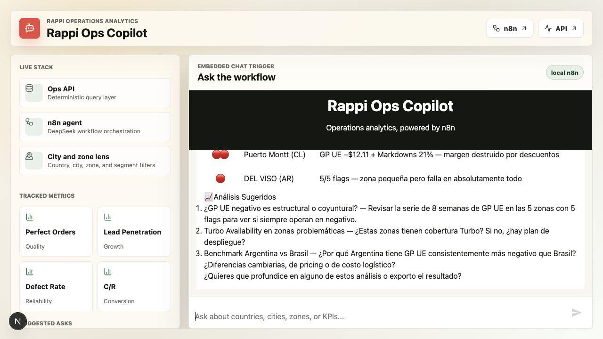
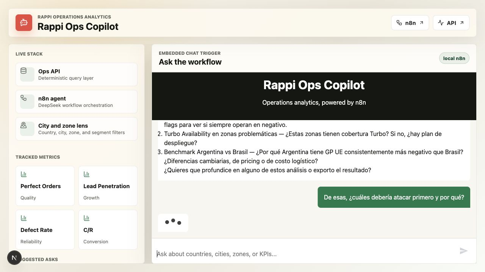
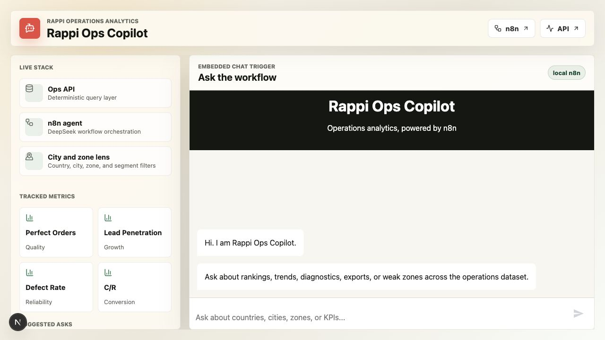
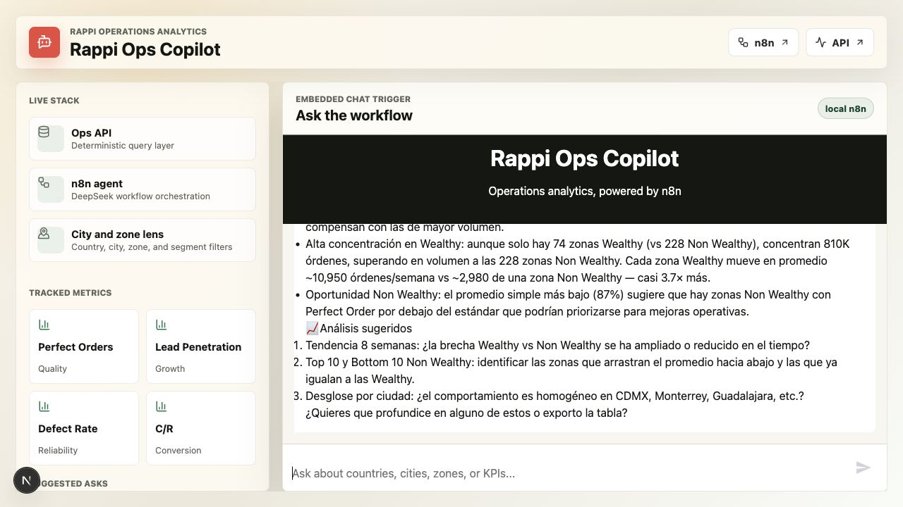
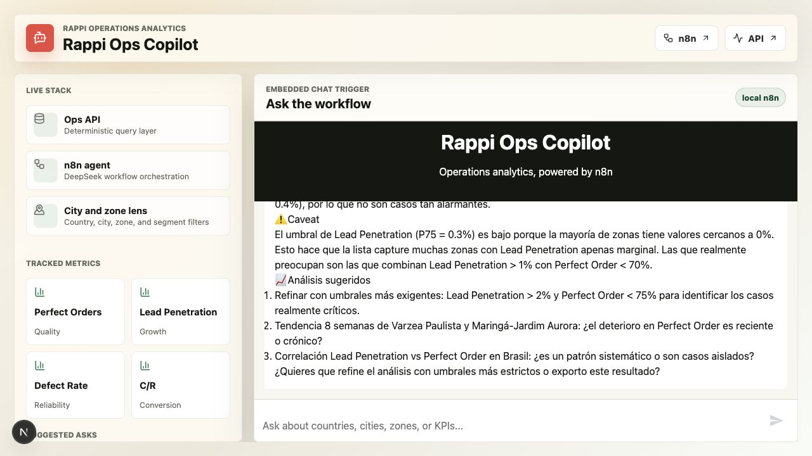
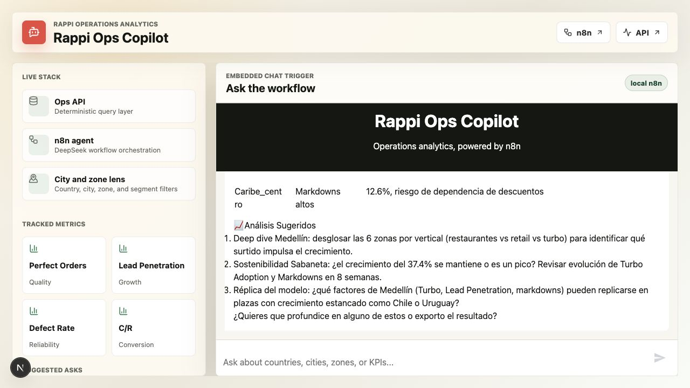
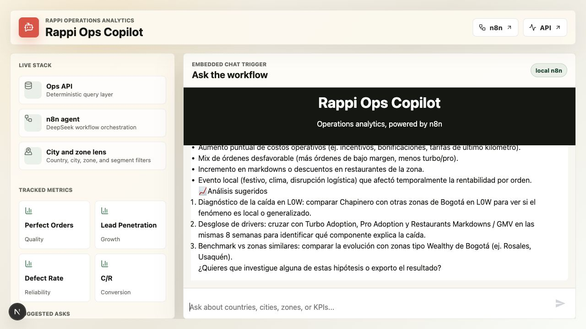

# Manual QA Report: Rappi Ops Copilot

| Field | Value |
|-------|-------|
| Date | 2026-06-16 |
| App URL | http://localhost:3000 |
| Session | rappi-ops-copilot-manual-qa |
| Scope | Manual validation of complex natural-language analytics queries, business context, proactive suggestions, conversational memory, visualizations, and exports |

## Summary

| Severity | Count |
|----------|-------|
| Critical | 0 |
| High | 1 |
| Medium | 2 |
| Low | 1 |
| Total | 4 |

## Capability Matrix

| Capability | Manual Result | Evidence |
|------------|---------------|----------|
| Filtering: top 5 zones by Lead Penetration | Pass. Returned a ranked top-5 table, outlier notes, and proactive follow-ups. Latency was ~45s. | screenshots/query-01-filtering-45s.png |
| Comparison: Perfect Order Wealthy vs Non Wealthy in Mexico | Pass with presentation issue. Returned segment comparison and interpretation, but exposed raw HTML tags. | screenshots/query-02-comparison.png |
| Time trend: Gross Profit UE in Chapinero for last 8 weeks | Pass. Returned 8-week table, week-over-week changes, hypotheses, and a text chart recommendation. | screenshots/query-03-trend.png |
| Aggregation: average Lead Penetration by country | Pass. Returned country table, min/max, outlier caveat, and proactive median suggestion. | screenshots/query-04-aggregation.png |
| Multivariable: high Lead Penetration, low Perfect Order | Pass but slow. Returned thresholds, affected zones, caveats, and suggested stricter analysis after ~85s. | screenshots/query-05-multivariable-85s.png |
| Inference: fastest-growing order zones and explanations | Pass but very slow. Returned growth ranking and plausible drivers after ~110s. | screenshots/query-06-inference-growth-110s.png |
| Business context: "zonas problemáticas" | Pass but very slow. Correctly interpreted as zones with multiple deteriorated metric flags after ~115s. | screenshots/query-07-business-context-problematic-zones-115s.png |
| Proactive analysis suggestions | Pass. Every successful answer included suggested follow-up analyses or export prompts. | screenshots/query-01-filtering-45s.png, screenshots/query-07-business-context-problematic-zones-115s.png |
| Conversational memory follow-up | Fail. "De esas, ¿cuáles debería atacar primero y por qué?" did not answer after ~115s. | screenshots/query-08-conversational-memory-followup-115s.png |
| Bonus: data visualization | Partial/fail. Chat provides ASCII/recommended charts, not rendered charts; API returns `visualization: null` even when `bar` is requested. | dogfood-output/api-export-check.json |
| Bonus: CSV/PDF export | Pass via documented API. CSV and one-page PDF exports were generated successfully. | manual-export-check.csv, manual-export-check.pdf |

## Issues

### ISSUE-001: Conversational memory follow-up does not answer

| Field | Value |
|-------|-------|
| Severity | high |
| Category | functional |
| URL | http://localhost:3000 |
| Repro Video | N/A |

**Description**

The required conversational memory behavior failed in a realistic follow-up. After the app answered "Muéstrame las zonas problemáticas esta semana", I asked "De esas, ¿cuáles debería atacar primero y por qué?". No answer appeared after roughly 115 seconds. The input returned to an active state and the browser console had no visible errors. Service logs around this area showed several `POST /sql` responses with `422 Unprocessable Entity`, which likely explains the silent failure path.

**Repro Steps**

1. Navigate to http://localhost:3000 and ask: "Muéstrame las zonas problemáticas esta semana".
   

2. In the same chat, ask: "De esas, ¿cuáles debería atacar primero y por qué?"
   

3. Observe that no assistant answer appears after ~115s, despite the input remaining available.

---

### ISSUE-002: Rich answers expose raw HTML tags instead of rendering the intended layout

| Field | Value |
|-------|-------|
| Severity | medium |
| Category | content / visual |
| URL | http://localhost:3000 |
| Repro Video | N/A |

**Description**

The comparison answer includes literal HTML strings such as `
` and `
` in the chat transcript. The expected behavior is either rendered markup or plain Markdown/text without implementation markup leaking into the answer.

**Repro Steps**

1. Navigate to http://localhost:3000.
   

2. Ask: "Compara el Perfect Order entre zonas Wealthy y Non Wealthy en México".
   

3. Observe that the assistant response contains raw `
` tags before and after the comparison table.

---

### ISSUE-003: Complex queries are slow and have weak progress feedback

| Field | Value |
|-------|-------|
| Severity | medium |
| Category | performance / ux |
| URL | http://localhost:3000 |
| Repro Video | N/A |

**Description**

Several required query types eventually work but take long enough to feel stalled: filtering ~45s, multivariable ~85s, inference ~110s, and business-context diagnosis ~115s. During these waits, there is no durable progress indication in the captured DOM beyond the submitted message, so a user cannot tell whether the workflow is still processing, has failed, or is waiting on the model/API.

**Repro Steps**

1. Ask: "¿Qué zonas tienen alto Lead Penetration pero bajo Perfect Order?"
   

2. Ask: "¿Cuáles son las zonas que más crecen en órdenes en las últimas 5 semanas y qué podría explicar el crecimiento?"
   

3. Observe that answers can arrive only after extended waits and the UI does not clearly communicate backend progress.

---

### ISSUE-004: Visualization request path does not produce actual rendered charts

| Field | Value |
|-------|-------|
| Severity | low |
| Category | functional / content |
| URL | http://localhost:3000 and http://localhost:8000 |
| Repro Video | N/A |

**Description**

Visualization is a bonus requirement, but the current behavior is only partial. The chat recommends chart types or emits ASCII charts, not actual rendered line/bar charts. A documented API call with `"visualization": "bar"` returned `visualization: null` while still returning the tabular data.

**Repro Steps**

1. Ask: "Muestra la evolución de Gross Profit UE en Chapinero últimas 8 semanas".
   

2. Call the documented `/sql` API with `"visualization": "bar"` for a comparison query.
   Evidence: dogfood-output/api-export-check.json

3. Observe that the API response contains `"visualization": null`, and the UI shows chart recommendations/ASCII rather than a rendered visualization.

## Export Check

Manual API export check passed:

| Artifact | Result |
|----------|--------|
| dogfood-output/manual-export-check.csv | Valid CSV with 2 rows |
| dogfood-output/manual-export-check.pdf | Valid PDF, 1 page |

